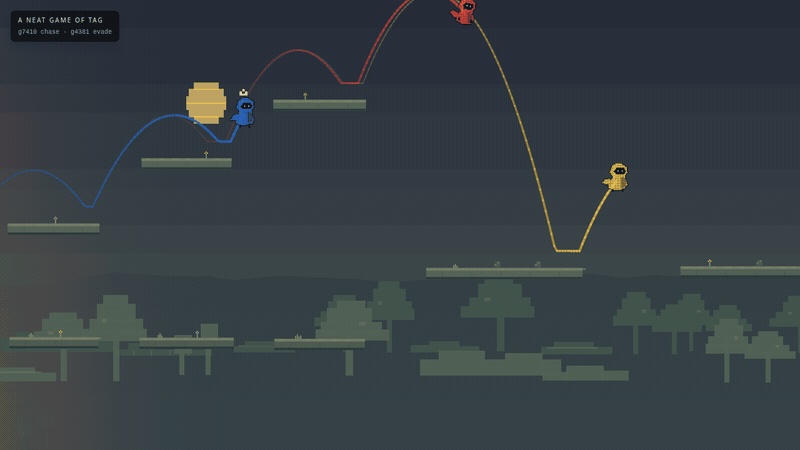

# A NEAT Game of Tag

*Evolving pursuit and evasion with NeuroEvolution of Augmenting Topologies*

[](https://github.com/semvdn/a-neat-game-of-tag/actions/workflows/ci.yml)

**Status:** v1.0 feature-frozen; current work focuses on evaluation, soak testing, and presentation rather than adding new gameplay systems.

An interactive neuroevolution project in which autonomous Chaser and Runner policies co-evolve to play tag across an infinite procedural platform world. The project combines a shared real-time/headless simulation, custom NEAT evolution, multi-agent evaluation, procedural terrain, diagnostic tooling, and a lightweight browser showcase.

[**▶ Open the live GitHub Pages demo**](https://semvdn.github.io/a-neat-game-of-tag/)

[](https://semvdn.github.io/a-neat-game-of-tag/)

*Gameplay recorded directly from the deployed lightweight demo using Chaser g7410 + Runner g4381.*

The public demo is deliberately lightweight: it ships the curated **Chaser g7410 + Runner g4381** pair and the visual simulation, but not the training worker, population checkpoint, experiment controls, or checkpoint-management UI. The full research application remains in this repository.


## What this project demonstrates

- **Neuroevolution and NEAT:** topology mutation, speciation, recurrent connections, champion retention, and separate co-evolving Chaser/Runner populations.
- **Multi-agent learning design:** common opponent panels, Hall-of-Fame opponents, deterministic evaluation, role-specific fitness, and safeguards against reward exploits.
- **Simulation engineering:** one shared gameplay core for both visible play and headless training, including platform physics, route-aware pursuit, moving platforms, respawn, body contacts, and failure handling.
- **Procedural systems:** deterministic infinite terrain, branching routes, ten visual/mechanical biomes, day/night presentation, and seeded evaluation worlds.
- **ML observability:** topology inspection, compact training telemetry, checkpointing, held-out evaluation, deterministic traces, and reproducibility checks.
- **Production-oriented presentation:** an offline exhibition mode plus a separate tree-shaken GitHub Pages showcase that reuses the exact simulation and trained policies without shipping the training infrastructure.

## Clone and run the full app locally

Requires **Node.js 22 or newer**, npm, and a modern desktop browser. An `.nvmrc` is included, so nvm users can run `nvm use` before installing dependencies.

```sh
git clone https://github.com/semvdn/a-neat-game-of-tag.git
cd a-neat-game-of-tag
npm install
npm run dev
```

Open the local URL printed by Vite. The full studio ships with the curated **generation 7422 full evolution checkpoint**, loaded automatically as the default showcase and evolutionary resume point. It preserves the exact display pair selected when exported—**Chaser g7410 + Runner g4381**—rather than substituting the older retained generalists stored elsewhere in the checkpoint.

Select **Start Simulation** to begin visible playback and background evolution. Visible playback and training can be paused independently. Use **Diagnostics → Runs & data** to import/export other full evolutionary checkpoints and analysis reports.

For a local installation/kiosk, choose **Exhibit** or open `?exhibit=1`. That mode auto-loads the bundled showcase and starts visible playback with background evolution paused. Add `&train=1` only when you intentionally want evolution to continue during an installation. **F** toggles browser fullscreen where supported; **G** or **Escape** returns to the studio.

## Run the lightweight web demo locally

```sh
npm install
npm run demo:dev
```

The demo starts on port 3001 and auto-runs the curated pair. Its controls are intentionally limited to presentation settings: playback speed, zoom, trails, senses, day/night mode, reset, pause and fullscreen.

Build the exact static site used by GitHub Pages with:

```sh
npm run build:demo
npm run preview:demo
```

Deployment is handled by [.github/workflows/pages.yml](.github/workflows/pages.yml); every push to `main` rebuilds and deploys `dist-demo/` automatically.

## Evaluate changes

```sh
npm run evaluate -- --seeds 32 --verify
npm run evaluate -- --checkpoint checkpoint.json --conditions evaluation/conditions.example.json --seeds 32 --trace
```

The lab uses the actual simulation and produces paired per-seed results, per-start breakdowns, and optional traces in `evaluations/report.json`. Without a checkpoint it uses explicitly untrained scripted controls. `--verify` checks encounter regressions, forbids unseeded episode randomness, and repeats episodes to check determinism.


## Design contracts

- Visible and headless play share movement, tagging, falling, fair respawn, terrain, and route accessibility.
- Policies sense **23 world-relative inputs** and emit **3 outputs**: signed horizontal drive, jump, and sprint. Camera position and display dimensions are presentation concerns.
- Compared candidates receive common seeded terrain, starts, and opponent panels. Breeding, held-out validation, champion retention, and display curation remain separate decisions.
- Tags and personal failures are the competitive outcomes. Pace, pursuit, and pressure shaping are capped; failed movement and respawn teleports must not become progress rewards.
- Moving platforms must remain safe across their complete swept motion; all generated surfaces remain solid regardless of sensing or route history.
- Runners obstruct and can stand on each other; a loaded Runner cannot jump. Chasers remain non-solid. World-space separation penalties encourage a compact group without rewarding contact or camping.
- The camera excludes clearly falling bodies and holds its framing when all relevant participants are falling.

Current checkpoints use `world-relative-senses-v3` and `signed-horizontal-controls-v2`. Older 25-input or four-output policies are incompatible. Current revision `solid-group-v12` adds solid Runner contacts, universal surfaces, moving-surface sweeps and bounded group-cohesion fitness without changing the controller schema; current-schema older checkpoints use the existing score-migration path.

## Core documentation

The public documentation is intentionally limited to the three mechanisms that define the project:

- [**World and platform generation**](docs/WORLD.md) — the infinite rolling world, branches, moving platforms, biome biases and terrain-safety invariants.
- [**NEAT and co-evolution setup**](docs/NEAT.md) — policy observations/actions, topology evolution, speciation, opponent leagues and champion validation.
- [**Reward function and shaping**](docs/REWARD_SHAPING.md) — competitive events, safe-progress shaping, pursuit/escape signals and anti-exploit constraints.

Implementation guidance for coding agents remains in [AGENTS.md](AGENTS.md) and `.agents/skills/`; it is not part of the public mechanism documentation.

## Validate

```sh
npm run check
git diff --check
```

`npm run typecheck` runs strict TypeScript validation with the official React, React DOM, Node, and Vite type definitions. `npm run check` then adds both production builds and the deterministic 8-seed regression suite. Build output and generated lab reports are ignored. Both production targets regenerate the Tailwind utility sheet locally and require no remote runtime assets. The full build carries the restorable evolution checkpoint; the Pages build carries only the compact showcase pair. Serve either build from HTTP rather than opening its `index.html` directly from `file://`.

## License

Released under the [MIT License](LICENSE).

## AI use

Generative AI, primarily OpenAI ChatGPT, was used extensively as a development tool throughout this project for architecture and experiment brainstorming, pair-programming and refactoring, debugging, documentation, and repository/presentation polish. Project goals, simulation and training design choices, evaluation criteria, checkpoint selection, visual direction, and final review remained human-directed, and AI-produced changes were iteratively inspected and tested against the running simulation and automated checks.

The agents shown in the demo are **not controlled by a large language model**. Their policies were evolved with the project's NEAT implementation; AI assistance was used in developing the software and research workflow around them.
